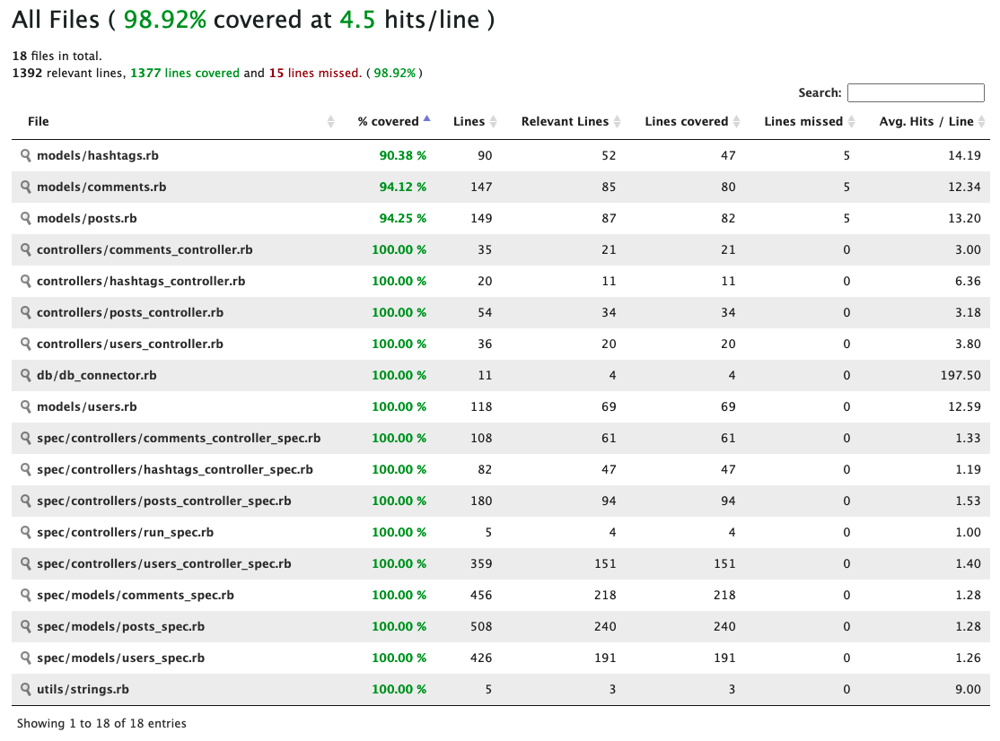

# Socialize: Social Media for Hashtagers

Simple social media API to share information thought post and comment belongs to user. The application also count hashtags based on posts and comments. Trending hashtags is hashtags order by counter in last 24 hours.

## User stories

1. As a user, I want to save my username, email, and bio description.
- Authentication and authorization is out of scope of this story and you don’t need to implement them

2. As a user, I want to post a text that might contain hashtag(s).
- Maximum limit of a text is 1000 characters
- A hashtag is a text that is followed by # symbol and case-insensitive, for instance: #generasigigih == #GenerasiGigih

3. As a user, I want to see all posts that contain a certain hashtag.
- A user can only filter by one hashtag at a time

4. As a user, I want to see the list of trending hashtags.
- Trending hashtags are the top 5 most posted hashtags in the past 24 hours
- A post containing multiple instances of a hashtag only counts as 1 occurrence for trending hashtags calculation

5. As a user, I want to comment on a post
- A comment can contain hashtag(s)
- A hashtag occurrence in a comment is counted in trending hashtags calculation

6. As a user, I want to attach things to a post and comment
- Three kinds of attachment are allowed: pictures (jpg, png, gif), video (mp4), and file (any other extensions outside of pictures and videos)

## Features

- Users
- Posts
- Comments
- Hashtags counted with posts and comments
- Trending hashtags

  
## Prerequisites

- Gem
- Ruby
- Mysql
- RSpec (testing purposes)

## Run Locally

Clone the project

```bash
  git clone https://github.com/ilhamsyahids/socialize-gigih
```

Go to the project directory

```bash
  cd socialize-gigih
```

Install dependencies

```bash
  bundle install
```

Add `socialize_db` database name and edit mysql config `db/db_connector.rb`. Then:

```bash
  mysql --password=[your_password] -u [your_username] socialize_db < socialize_db.sql
```

Start the server

```bash
  ruby main.rb
```

## Running Tests

To run tests, run the following command

```bash
  rspec -f d spec/run_test.rb
```

  
## Tech Stack

- Ruby
- Mysql


## Deployment

### Ansible

Change desired host in `inventory.yml`

Review and edit to the desired configuration in `playbook.yml`

To run deployment :

```bash
  ansible-playbook -i inventory.yml playbook.yml  --user [user] --private-key [your_private_key]
```

Example:

```bash
  ansible-playbook -i inventory.yml playbook.yml  --user ilham --private-key ~/.ssh/id_edxxxx
```


## Screenshots

### Coverage



  
## Acknowledgements

 - Generasi Gigih
 - YABB
 - Gojek
